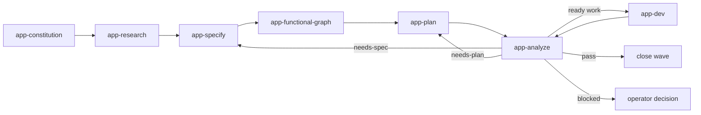

# Bears App-Based Workflow Contract

## Purpose

Turn app intent into researched waves, decision-complete specifications, functional graph nodes, graph-linked ledger tasks, delegated implementation, and convergence analysis.

## Instruction ownership

- Root and nearest `AGENTS.md` files own mandatory local rules.
- Workspace contracts own shared invariants.
- `skills/app-dev` owns fixed L1-to-L2 orchestration, L2 task decomposition, lane partitioning, and wave closeout.
- `skills/subagents` owns the role-selection and dispatch procedure, packets, lifecycle, and fail-closed outcomes for each concrete L3 assignment.
- Other `app-*` skills own only their stage goal, payload, artifact, and transition rules.
- `skills/instruction-hardening` owns instruction-edit routing.
- `agents/*.toml` owns each role's unique behavior, model, reasoning effort, and sandbox.
- External autoCI owns tests, validators, audits, and cache checks.

## Delegation contract

Every `app-*` skill uses `subagents` before data access. A solo parent or app-dev L2 decomposes its bounded task first, then follows the procedure for each concrete L3 assignment. Parent, L1, and L2 coordinate through compact packets only. Selected L3 helpers, workers, and critics perform file, log, terminal, Git, script, MCP, runtime, and network work.

`skills/app-dev/SKILL.md` defines the parent-as-L1 sequence, fixed L2 lanes, and L2 decomposition boundaries. `skills/subagents/SKILL.md` is the only definition of the concrete L3 selector and dispatch procedure, failure outcomes, and `role-request.v1`, `role-selection.v1`, `dispatch-packet.v1`, and `result-packet.v1`. The skill is not a task recipient or runtime. Outside app-dev, a solo parent performs the L2 sequence without creating an L1 or L2 subagent.

## Workflow

Before data access at each node, the solo parent decomposes its stage task and follows `subagents` per assignment. In app-dev, its fixed L2 performs that decomposition instead.

## Stage outputs

### `app-constitution`

Writes `docs/app-constitution.md` with app scope, decision owner, actors, constraints, data and secret boundaries, closeout evidence, and open decisions.

### `app-research`

Writes the wave registry plus `waves/<wave-id>/research.md` with scope, sources, known behavior, unknowns, decisions, and follow-up questions.

### `app-specify`

Writes `waves/<wave-id>/spec.md` with actors, permissions, flows, data ownership, errors, integrations, acceptance criteria, graph hints, and unresolved decisions.

### `app-functional-graph`

Writes `docs/app-functional-graph.v1.json` and ledger anchors. Every executable task references at least one functionality id and graph node.

### `app-plan`

Writes `waves/<wave-id>/plan.md` and updates graph-linked ledger tasks for missing or drifted, decision-complete behavior.

### `app-analyze`

Writes `waves/<wave-id>/analysis.md` with `pass`, `needs-plan`, `needs-spec`, or `blocked` status and one exact handoff.

### `app-dev`

Partitions dependency-ready ledger tasks into fixed non-overlapping L2 lanes. Each L2 decomposes its lane tasks, then follows `subagents` for each concrete L3 assignment; app-dev never duplicates L3 role selection or lifecycle logic.

## Instruction editing

`skills/instruction-hardening/SKILL.md` is the canonical instruction-edit procedure. It always uses `bears-instruction-editor`; a role change first uses `bears-role-editor-auditor` for approved semantics.

## Role registration

`agents/` is the only TOML source. `./install` adds marked `config_file` links to `$CODEX_HOME/config.toml`; `./install uninstall` removes only that managed block. A changed registration requires a new Codex task.

The plugin contains no tests, validator scripts, audit scripts, or manual verification workflow. Pending external autoCI evidence is not a pass.

## External role-sync autoCD

After one-time local marketplace bootstrap, a local post-push candidate may record the exact `main` SHA. It does not run `./install`. An external controller automatically installs only that SHA after local autoCI returns `PASS` for the same SHA. The controller refreshes the local marketplace cache from a clean checkout pinned to that SHA before installation. The plugin provides no candidate producer, controller, cache-refresh code, validation, or parent fallback.
