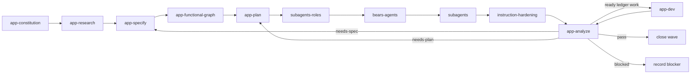

# Bears App-Based Workflow Contract

## Purpose

Provide a compact Codex plugin that turns product-app intent into researched waves, detailed specs, functional graph nodes, graph-linked ledger tasks, hardened implementation dispatch packets, role-matched subagent orchestration, and convergence analysis.

## Terms

- `wave`: one app workflow slice created by research, specified through source-backed decisions, planned through graph-linked ledger tasks, analyzed against code state, and dispatched when dependency-ready.
- `functional graph`: `docs/app-functional-graph.v1.json`, the app-local map of functionality, nodes, edges, state transitions, API calls, and evidence references.
- `task ledger`: `docs/app-task-ledger.v1.json`, the app-local source of executable tasks.
- `instruction hardening`: read-only compression of wave plans, dispatch packets, or workflow prose without changing product decisions, task scope, instruction authority, `AGENTS.md`, or contracts.
- `role-matched subagent`: a bounded worker whose profile matches the task role and whose packet names exact repo, paths, graph refs, target set, and completion criteria.
- `parallel lane`: an L2 partition whose repo, paths, target set, generated artifacts, and evidence outputs do not overlap another lane.
- `pre-commit autoCI`: the automatic commit-boundary system that owns validation, test, audit, route, cache, cachebuster, quick-validate, and plugin-validate scripts.
- `L1`: the parent app-dev coordinator.
- `L2`: one orchestrator lane for a ready wave or wave partition.
- `L3`: one worker or critic assigned a bounded ledger task.

## Workflow

## Script ownership

Validation, test, audit, route, cache, cachebuster, quick-validate, and plugin-validate scripts are pre-commit autoCI responsibilities. Agents do not run them manually. Agents read generated autoCI or local-commit-validation evidence only after it exists, then fix known failures in owned files.

The plugin package must not add `scripts/`, `hooks.json`, `.mcp.json`, or manifest fields for those files.

## Stage contracts

### app-constitution

Input: app target, owner, product constraints, non-negotiable rules, existing docs.

Output: `docs/app-constitution.md` and wave links when they already exist.

### app-research

Input: user intent, app target, existing waves, relevant sources.

Output:

- `wave-research.packet`
- `waves/index.md`
- `waves/<wave-id>/research.md`

Each wave records scope, unknowns, sources, decisions, follow-up questions, sync status, and candidate parallel lanes.

### app-specify

Input: one or more research waves and open questions.

Output: `waves/<wave-id>/spec.md` with actors, flows, data, errors, acceptance criteria, unresolved decisions, and graph hints.

### app-functional-graph

Input: specified waves and existing graph or ledger files.

Output:

- `docs/app-functional-graph.v1.json`
- graph references for `docs/app-task-ledger.v1.json`

Every executable task must reference at least one functionality id and one graph node ref.

### app-plan

Input: wave specs, graph, ledger, and implemented-state notes.

Output:

- `waves/<wave-id>/plan.md`
- updated `docs/app-functional-graph.v1.json`
- updated `docs/app-task-ledger.v1.json`
- L2/L3 lane plan with disjoint repo, path, and target sets

`app-plan` creates only decision-complete tasks. Missing decisions return to `app-specify`. It applies read-only `instruction-hardening` to the wave plan and candidate dispatch packets before app-dev handoff. It maximizes parallel lanes when write scopes and evidence outputs do not overlap.

### subagents-roles

Input: graph-linked tasks, target paths, proof requirements, and dependency edges.

Output: role packet with owner role, critic role, lane, path scope, parallel safety, and role gaps.

### bears-agents

Input: role packet, task ledger, wave plan, and Bears role inventory.

Output: role coverage packet for every lane and L3 task.

### subagents

Input: role coverage packet, ready ledger tasks, target paths, and completion criteria.

Output: bounded L2/L3 delegation packets for role-matched subagents.

### instruction-hardening

Input: wave plan, candidate dispatch packets, and target `AGENTS.md` or linked contracts.

Output: compressed text, removed-content summary, and authority or drift note.

`instruction-hardening` is read-only. It never creates tasks, changes product decisions, runs scripts, or overrides `AGENTS.md` and contracts.

### app-analyze

Input: docs, graph, ledger, and implemented code state.

Output: `waves/<wave-id>/analysis.md` with status `pass`, `needs-plan`, `needs-spec`, or `blocked`.

Missing functionality returns to `app-plan`. Missing requirements return to `app-specify`. Ready ledger work goes to `app-dev`. `pass` closes the wave.

### app-dev

Input: ledger tasks with valid graph refs, ready dependencies, role coverage, hardened packets, and disjoint lane plan.

Output: L2 dispatch packets, L3 task packets, ledger status updates, changed-file lists, generated evidence refs when present, and wave closeout notes.

`app-dev` never invents implementation tasks outside the ledger. L1 starts L2 lanes. L2 starts L3 workers and critics. Every specific implementation, review, or integration task goes to a role-matched subagent. Planning and development maximize parallelism across disjoint repo, path, and target sets.

## Scenario prompts

- “research app feature” uses `app-research` and creates or updates waves.
- “specify this wave” uses `app-specify` and expands wave docs.
- “plan unbuilt functionality” uses `app-plan`, `subagents-roles`, `bears-agents`, and `subagents` to write graph-linked ledger tasks and lane packets.
- “analyze implemented state” uses `app-analyze` and reports missing or drifted functionality.
- “harden this wave” uses `instruction-hardening` and tightens wave prose without changing authority.
- “dev ready wave” uses `app-dev` with role-matched L2/L3 subagents.
