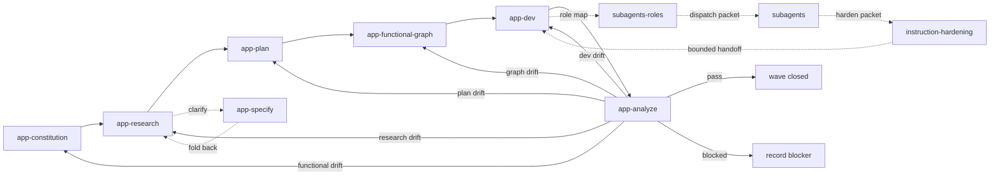

# Bears App-Based Workflow Contract

## Purpose

Provide a self-contained Codex plugin that turns app functional truth into source-backed research, approved sequential microtasks, a dev-stage functional graph, bounded implementation packets, and `app-analyze` convergence plus reuse-quality audit.

## Terms

- `app constitution`: `docs/app-constitution.md`, the app-local source of truth for functional capabilities, gaps, decisions, constraints, and evidence needs.
- `execution constraints`: session-specific instruction, path, secret, evidence, or tool limits. They constrain execution but do not own plugin functional truth.
- `wave`: one sequential workflow slice that explains constitution items through research, decomposes them through plan microtasks, models future dev behavior through the functional graph, and then supports app-dev and app-analyze.
- `research explanation`: a wave section that names sources, decisions, unknowns, and the constitution ids it explains.
- `plan microtask`: one ordered app-plan unit recorded in `docs/app-task-ledger.v1.json`, linked to constitution and research refs.
- `approved microtask`: a microtask with constitution refs, research refs, target paths, dependencies, roles, definition of done, proof requirement, and status `ready_for_graph` or later.
- `functional graph`: `docs/app-functional-graph.v1.json`, the app-local dev-stage model built after planning from approved microtasks.
- `graph lineage`: the required chain `constitution_refs -> research_refs -> plan_task_refs` on every graph node.
- `handoff packet`: a versioned packet from `docs/handoff-packet-contracts.md` used between skills.
- `instruction hardening`: read-only compression of wave plans, dispatch packets, or workflow prose without changing functional decisions, task scope, constitution truth, or execution constraints.
- `role-matched subagent`: a bounded worker whose packet names exact task, refs, paths, role, dependencies, and completion criteria.
- `autoCI`: an external automatic verification line. Plugin skills do not require a specific autoCI implementation.

## Core workflow

The main artifact order is always `app-constitution -> app-research -> app-plan -> app-functional-graph -> app-dev -> app-analyze`. Support skills do not create new main stages.

## Script ownership

Validation, test, audit, route, cache, cachebuster, quick-validate, and plugin-validate scripts are external automation responsibilities. Plugin skills do not ask agents to run them manually or create validation tooling for this workflow.

The plugin package must not add `scripts/`, `hooks.json`, `.mcp.json`, or manifest fields for those files.

## Stage contracts

### app-constitution

Input: app target, owner, product constraints, non-negotiable functional rules, existing docs, existing workflow artifacts, and execution constraints when supplied by the current session.

Output: `docs/app-constitution.md` with functional ids, capabilities, gaps, open decisions, execution constraints, and evidence needs.

Gate: every functional capability has a stable id, owner, evidence need, and known gap or accepted state.

### app-research

Input: user intent, app target, `docs/app-constitution.md`, existing waves, relevant sources, execution constraints when supplied, and user answers.

Output:

- `wave-research.packet.v1`
- `waves/index.md`
- `waves/<wave-id>/research.md`

Gate: every touched wave states which constitution ids it explains and records sources, decisions, unknowns, and next route. New functional truth or drift returns to `app-constitution`.

### app-specify

Input: research wave questions that cannot be resolved from current sources.

Output: `clarification.packet.v1` folded back into `waves/<wave-id>/research.md` when a wave file exists, or returned in the response when no wave file exists.

Gate: clarification is complete enough for `app-plan`; this helper does not create plan tasks or graph nodes.

### app-plan

Input: `docs/app-constitution.md`, wave research, current task ledger, implemented-state notes when present, and execution constraints when supplied.

Output:

- `waves/<wave-id>/plan.md`
- updated `docs/app-task-ledger.v1.json`
- approved microtasks with constitution and research refs

Gate: every microtask references one or more constitution ids and research sections, has an order, target paths, dependencies, planned owner and critic roles, definition of done, proof requirement, and status. Planning does not create graph nodes.

### app-functional-graph

Input: constitution, research waves, approved plan microtasks, and existing graph or ledger files.

Output:

- `docs/app-functional-graph.v1.json`
- graph refs and backlinks for `docs/app-task-ledger.v1.json`

Gate: every graph node has complete lineage through constitution refs, research refs, and plan task refs. The graph models the future `app-dev` stage.

### app-dev

Input: graph nodes with complete lineage, ready dependencies, planned roles, optional support packets, and exact target paths.

Output: task status updates, changed-file lists, generated evidence refs when present, and wave closeout notes.

`app-dev` never invents implementation tasks outside the ledger or graph. If support subagents are unavailable, the parent runs the same bounded packet sequentially and records that fallback.

### app-analyze

Input: constitution, research, plan, graph, ledger, implementation state, and plugin files when file-audit mode is requested.

Output: `waves/<wave-id>/analysis.md` with status `pass`, `needs-constitution`, `needs-research`, `needs-plan`, `needs-graph`, `needs-dev`, or `blocked`.

`app-analyze` also owns file-level instruction quality audits for usefulness, consistency, brevity, unambiguity, instruction coverage, portability, degradation resistance, and no-test-tooling risk.

Functional drift returns to `app-constitution`. Research drift returns to `app-research`. Plan drift returns to `app-plan`. Graph drift returns to `app-functional-graph`. Dev drift returns to `app-dev`. Execution-constraint drift is reported separately and must not rewrite functional truth.

## Support skill contracts

### subagents-roles

Input: graph-backed tasks, target paths, proof requirements, dependencies, and `docs/role-catalog.md`.

Output: `role-packet.v1` with confirmed owner role, critic role, helper roles, path scope, sequential readiness, and role gaps.

### subagents

Input: role packet, ready graph-backed tasks, target paths, and completion criteria.

Output: `dispatch-packet.v1` for one bounded sequential handoff.

### instruction-hardening

Input: wave plan, candidate dispatch packet, and execution constraints when supplied.

Output: `hardening-output.v1` with compressed text, removed-content summary, and drift note.

`instruction-hardening` is read-only. It never creates tasks, changes functional decisions, runs scripts, or overrides execution constraints.

## Change-management rule

When `README.md`, `SPEC.md`, `.codex-plugin/plugin.json`, `skills/`, `templates/`, or workflow contracts change, refresh the affected constitution, research, plan, graph, ledger, and analysis artifacts in the same commit unless the change is explicitly cosmetic.

## Scenario prompts

- “establish app source of truth” uses `app-constitution`.
- “research app feature” uses `app-research` and explains constitution ids.
- “clarify this wave” uses `app-specify` as a helper and folds decisions into research.
- “plan this wave” uses `app-plan` to write approved sequential microtasks.
- “model planned dev work” uses `app-functional-graph` to build graph nodes from plan microtasks.
- “dev ready wave” uses `app-dev` only after complete graph lineage exists.
- “harden this packet” uses `instruction-hardening` and tightens prose without changing functional truth.
- “analyze implemented state” uses `app-analyze` and reports the exact broken lineage link.
- “audit plugin reuse quality” uses `app-analyze` file-audit mode and reports exact file-level concerns.
