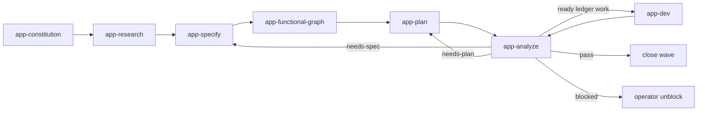

# Bears App-Based Workflow Contract

## Purpose

Provide a compact Codex plugin that turns product-app intent into researched waves, detailed specs, functional graph nodes, graph-linked ledger tasks, implementation dispatch packets, and convergence analysis.

## Terms

- `wave`: one app workflow slice created by research, specified by user interaction, planned through graph-linked ledger tasks, analyzed against code state, and dispatched when dependency-ready.
- `functional graph`: `docs/app-functional-graph.v1.json`, the app-local map of functionality, nodes, edges, state transitions, API calls, and evidence references.
- `task ledger`: `docs/app-task-ledger.v1.json`, the app-local source of executable tasks.
- `L1`: the parent app-dev coordinator.
- `L2`: one orchestrator lane for a ready wave or wave partition.
- `L3`: one worker or critic assigned a bounded ledger task.

## Workflow

## Stage contracts

### app-constitution

Input: app target, owner, product constraints, non-negotiable rules, existing docs.

Output: `docs/app-constitution.md` and optional wave links.

### app-research

Input: user intent, app target, existing waves, relevant sources.

Output:

- `wave-research.packet`
- `waves/index.md`
- `waves/<wave-id>/research.md`

Each wave records scope, unknowns, sources, decisions, follow-up questions, and sync status.

### app-specify

Input: one or more research waves and open questions.

Output: `waves/<wave-id>/spec.md` with actors, flows, data, errors, acceptance criteria, unresolved decisions, and graph hints.

### app-functional-graph

Input: specified waves and existing graph or ledger files.

Output:

- `docs/app-functional-graph.v1.json`
- graph references for `docs/app-task-ledger.v1.json`

Every executable task must reference at least one functionality id and one graph node ref.

### app-plan

Input: wave specs, graph, ledger, and implemented-state notes.

Output:

- `waves/<wave-id>/plan.md`
- updated `docs/app-functional-graph.v1.json`
- updated `docs/app-task-ledger.v1.json`

`app-plan` creates only decision-complete tasks. Missing decisions return to `app-specify`.

### app-analyze

Input: docs, graph, ledger, and implemented code state.

Output: `waves/<wave-id>/analysis.md` with status `pass`, `needs-plan`, `needs-spec`, or `blocked`.

Missing functionality returns to `app-plan`. Missing requirements return to `app-specify`. Ready ledger work goes to `app-dev`. `pass` closes the wave.

### app-dev

Input: ledger tasks with valid graph refs and ready dependencies.

Output: L2 dispatch packets, L3 task packets, ledger status updates, and wave closeout notes.

`app-dev` never invents implementation tasks outside the ledger. L1 starts L2 lanes. L2 starts L3 workers and critics through `subagents`. `bears-agents` selects role coverage.

## Scenario prompts

- “research app feature” uses `app-research` and creates or updates waves.
- “specify this wave” uses `app-specify` and expands wave docs.
- “plan unbuilt functionality” uses `app-plan` and writes graph-linked ledger tasks.
- “analyze implemented state” uses `app-analyze` and reports missing or drifted functionality.
- “dev ready wave” uses `app-dev` and prepares L2/L3 dispatch packets.
