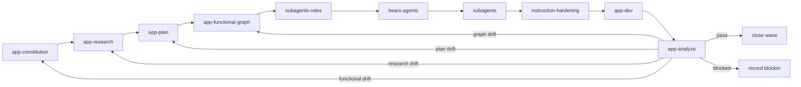

# Bears App-Based Workflow Contract

## Purpose

Provide a self-contained Codex plugin that turns app functional truth into source-backed research, sequential plan microtasks, a dev-stage functional graph, hardened implementation packets, role-aware handoffs, and convergence analysis.

## Terms

- `app constitution`: `docs/app-constitution.md`, the app-local source of truth for functional capabilities, gaps, decisions, constraints, and evidence needs.
- `wave`: one sequential workflow slice that explains constitution items through research, decomposes them through plan microtasks, models future dev behavior through the functional graph, and then supports app-dev and app-analyze.
- `research explanation`: a wave section that names sources, decisions, unknowns, and the constitution ids it explains.
- `plan microtask`: one ordered app-plan unit recorded in `docs/app-task-ledger.v1.json`, linked to constitution and research refs.
- `functional graph`: `docs/app-functional-graph.v1.json`, the app-local dev-stage model built after planning from approved microtasks.
- `graph lineage`: the required chain `constitution_refs -> research_refs -> plan_task_refs` on every graph node.
- `host policy`: any instruction, path, secret, evidence, or tool rule supplied by the live Codex environment. It may constrain execution, but it is not a source of plugin functional truth.
- `instruction hardening`: read-only compression of wave plans, dispatch packets, or workflow prose without changing functional decisions, task scope, constitution truth, or host policy.
- `role-matched subagent`: a bounded worker whose profile matches the task role and whose packet names exact repo, paths, graph refs, target set, and completion criteria.
- `autoCI`: an external automatic verification line. Plugin skills do not require a specific autoCI implementation.

## Workflow

## Script ownership

Validation, test, audit, route, cache, cachebuster, quick-validate, and plugin-validate scripts are external automation responsibilities. Plugin skills do not ask agents to run them manually.

The plugin package must not add `scripts/`, `hooks.json`, `.mcp.json`, or manifest fields for those files.

## Stage contracts

### app-constitution

Input: app target, owner, product constraints, non-negotiable functional rules, existing docs, existing workflow artifacts, and host policy notes when supplied by the current session.

Output: `docs/app-constitution.md` with functional ids, capabilities, gaps, open decisions, constraints, and evidence needs.

Gate: every functional capability has a stable id, owner, evidence need, and known gap or accepted state.

### app-research

Input: user intent, app target, `docs/app-constitution.md`, existing waves, relevant sources, and host policy notes when supplied.

Output:

- `wave-research.packet`
- `waves/index.md`
- `waves/<wave-id>/research.md`

Gate: every touched wave states which constitution ids it explains and records sources, decisions, unknowns, and next route. New functional truth or drift returns to `app-constitution`.

### app-specify

Input: research wave questions that cannot be resolved from current sources.

Output: clarified actors, flows, data, errors, acceptance criteria, and decisions folded back into `waves/<wave-id>/research.md`.

Gate: clarification is complete enough for `app-plan`; this helper does not create plan tasks or graph nodes.

### app-plan

Input: `docs/app-constitution.md`, wave research, current task ledger, implemented-state notes when present, and host policy notes when supplied.

Output:

- `waves/<wave-id>/plan.md`
- updated `docs/app-task-ledger.v1.json`
- plan microtasks with constitution and research refs

Gate: every microtask references one or more constitution ids and research sections, has an order, target paths, definition of done, proof requirement, and status. Planning does not create graph nodes.

### app-functional-graph

Input: constitution, research waves, approved plan microtasks, and existing graph or ledger files.

Output:

- `docs/app-functional-graph.v1.json`
- graph refs and backlinks for `docs/app-task-ledger.v1.json`

Gate: every graph node has complete lineage through constitution refs, research refs, and plan task refs. The graph models the future `app-dev` stage.

### subagents-roles

Input: graph-backed tasks, target paths, proof requirements, and dependency edges.

Output: role packet with owner role, critic role, helper roles, path scope, sequential readiness, and role gaps.

### bears-agents

Input: role packet, task ledger, wave plan, and Bears role inventory.

Output: role coverage packet for each ready task or handoff.

### subagents

Input: role coverage packet, ready graph-backed tasks, target paths, and completion criteria.

Output: bounded sequential delegation packets for role-matched subagents.

### instruction-hardening

Input: wave plan, candidate dispatch packets, and host policy notes when supplied.

Output: compressed text, removed-content summary, and drift note.

`instruction-hardening` is read-only. It never creates tasks, changes functional decisions, runs scripts, or overrides host policy.

### app-dev

Input: graph nodes with complete lineage, ready dependencies, role coverage, hardened packets, and exact target paths.

Output: task status updates, changed-file lists, generated evidence refs when present, and wave closeout notes.

`app-dev` never invents implementation tasks outside the ledger or graph.

### app-analyze

Input: constitution, research, plan, graph, ledger, and implemented code state.

Output: `waves/<wave-id>/analysis.md` with status `pass`, `needs-constitution`, `needs-research`, `needs-plan`, `needs-graph`, `needs-dev`, or `blocked`.

Functional drift returns to `app-constitution`. Research drift returns to `app-research`. Plan drift returns to `app-plan`. Graph drift returns to `app-functional-graph`. Host-policy drift is reported separately and must not rewrite functional truth.

## Scenario prompts

- “establish app source of truth” uses `app-constitution`.
- “research app feature” uses `app-research` and explains constitution ids.
- “clarify this wave” uses `app-specify` as a helper and folds decisions into research.
- “plan this wave” uses `app-plan` to write sequential microtasks.
- “model planned dev work” uses `app-functional-graph` to build graph nodes from plan microtasks.
- “harden this wave” uses `instruction-hardening` and tightens wave prose without changing functional truth.
- “dev ready wave” uses `app-dev` only after complete graph lineage exists.
- “analyze implemented state” uses `app-analyze` and reports the exact broken lineage link.
