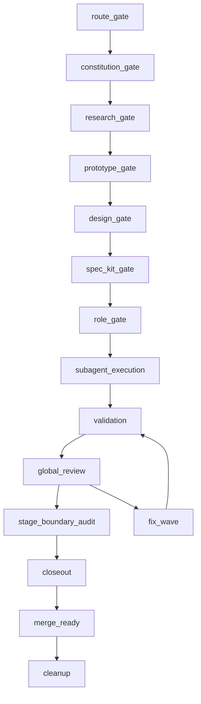

# Agent Workflow Map

Canonical executable workflow source: `assets/catalog/agent-workflow-map.v1.json`. `autoCI` or local commit validation owns `python3 scripts/agent_workflow_map.py validate`; agents must not run it manually unless the operator names the exact command in the current turn.

This document is a reference view only. The JSON map is the primary executable lifecycle authority for lifecycle order, graph edges, review gates, state bindings, dirty triage, worker state files, hook automation policy, subagent waves, and role/stage compatibility.

## Lifecycle graph

Blocking gates: `closeout`, `merge_ready`, `cleanup`.

Intermediate stages record evidence and continue orchestration. `global_review` is required before `closeout` and `merge_ready`; it does not create an intermediate review blocker.

## Worker state policy

Global workflow-state is an index and aggregate only.

Each worker writes only `runtime/agent-workflow/<goal_id>/workers/<worker_id>/worker-state.v1.json`.

Workers do not write the shared workflow-state aggregate. The aggregator refresh reads worker files and updates workflow-state.

This avoids write contention: concurrent workers write separate files, so they do not collide on one shared aggregate file.

This prevents orchestrator blocking during intermediate stages: the orchestrator reads heartbeats and aggregate index status, then blocks only at `closeout`, `merge_ready`, and `cleanup`.

## Hook automation policy

Hook policy is local-only and disabled until `hook_trust` and `effective_hooks` proof exists.

This change does not register runtime hooks.

- `pre_task`: writes `worker_state_file`; actions `create_or_validate_worker_state, create_or_validate_scope_lock`; forbidden writes `workflow_state_aggregate`.
- `heartbeat`: writes `worker_state_file`; actions `update_heartbeat, update_current_stage, update_status`; forbidden writes `workflow_state_aggregate, other_worker_state_files`.
- `closeout`: writes `worker_state_file`; actions `record_worker_closeout, record_validation_evidence, mark_integration_needed`; forbidden writes `workflow_state_aggregate`.
- `aggregator_index_refresh`: writes `workflow_state_aggregate`; actions `read_worker_files, refresh_workflow_state_index, refresh_workflow_state_aggregate`; forbidden writes `worker_state_files`.

## Dirty triage

- `active_parallel_agent`: does_not_block_intermediate_stages.
- `completed_needs_integration`: blocks_closeout_until_integrated.
- `abandoned_needs_review`: blocks_cleanup_until_classified.
- `useful_abandoned_code`: blocks_merge_ready_until_validated_or_removed.
- `obsolete_cleanup_candidate`: blocks_cleanup_until_reviewed.
- `unsafe_dirty_blocker`: blocks_closeout_merge_ready_cleanup.

## State bindings

- `route_gate` -> `route-decision` -> `workflow_state.route`
- `constitution_gate` -> `constitution-decision` -> `workflow_state.constitution`
- `research_gate` -> `research-evidence` -> `workflow_state.research`
- `prototype_gate` -> `prototype-evidence` -> `workflow_state.prototype`
- `design_gate` -> `design-artifact` -> `workflow_state.design`
- `spec_kit_gate` -> `spec-kit-status` -> `workflow_state.spec_kit`
- `role_gate` -> `role-coverage` -> `workflow_state.role_gate`
- `subagent_execution` -> `subagent-assignment-status` -> `workflow_state.execution`
- `validation` -> `validation-evidence` -> `workflow_state.validation`
- `global_review` -> `global-review-result` -> `workflow_state.review`
- `fix_wave` -> `fix-wave-output` -> `workflow_state.fix_wave`
- `stage_boundary_audit` -> `stage-boundary-audit` -> `workflow_state.stage_boundary`
- `closeout` -> `closeout-packet` -> `workflow_state.closeout`
- `merge_ready` -> `merge-ready-packet` -> `workflow_state.merge_ready`
- `cleanup` -> `cleanup-packet` -> `workflow_state.cleanup`
